Enlace al repositorio: (https://github.com/Pablocifp/examenGIT)  
### Ejercicio 1
## 1-
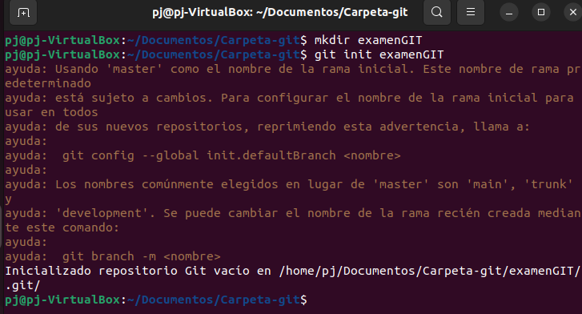
## 2,3-
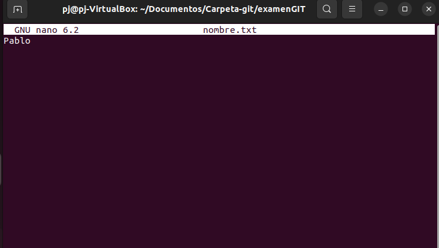
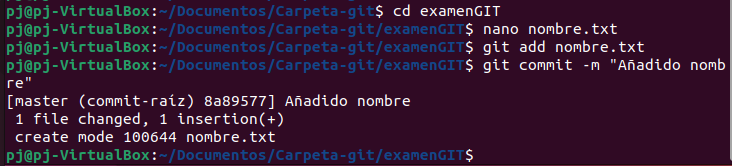
## 4-
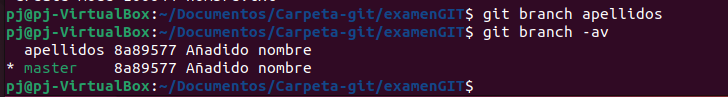
## 5-
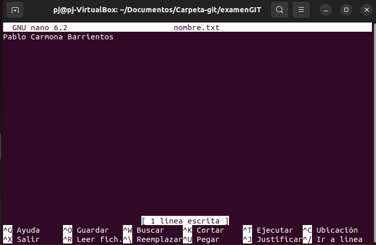
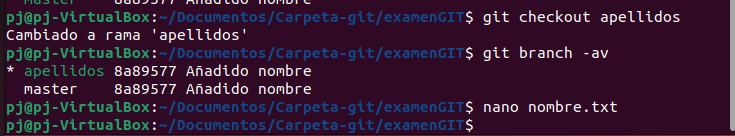
## 6-
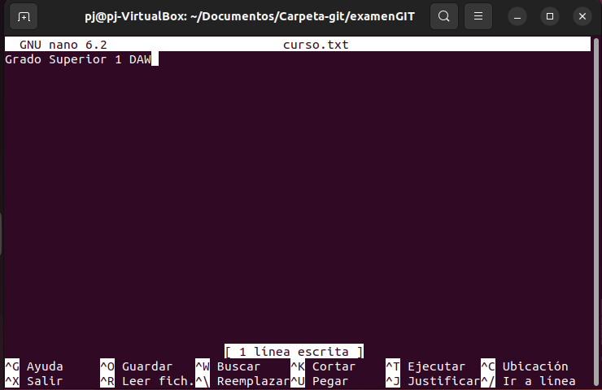
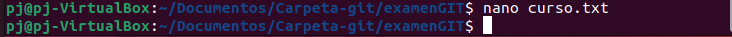
## 7-
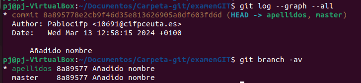
## 8- 

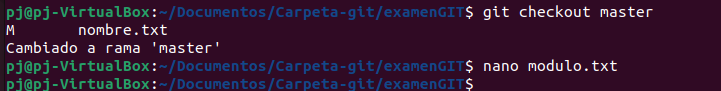
## 9,10-
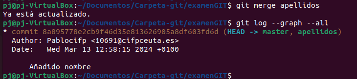
### Ejercicio 2
## 1-
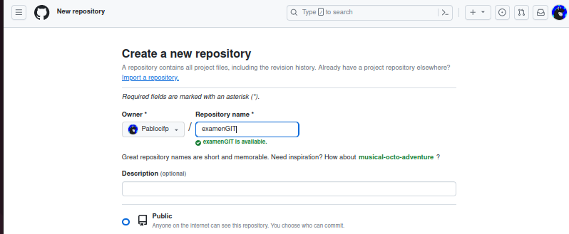
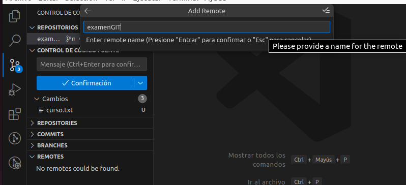
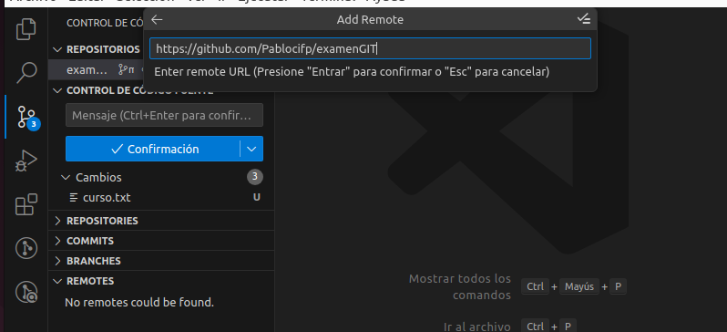

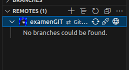
## 2-
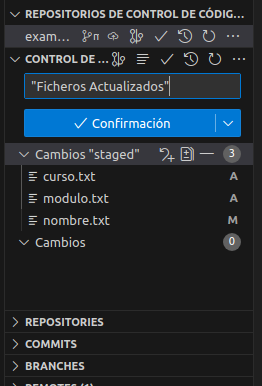

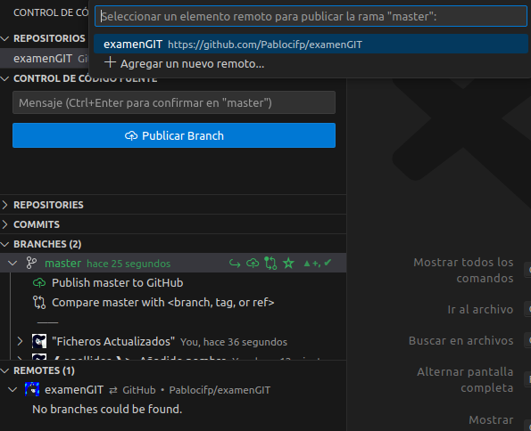
## 3-
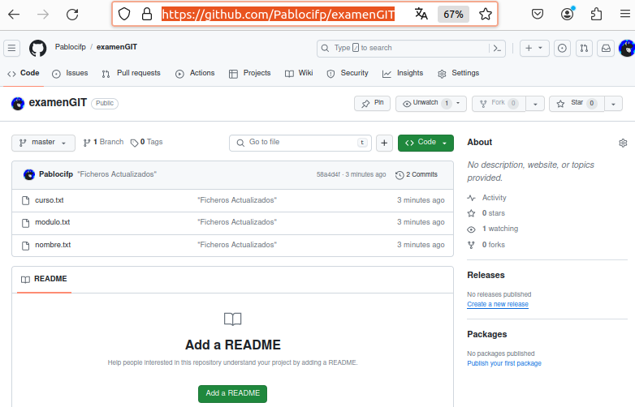
## 4-
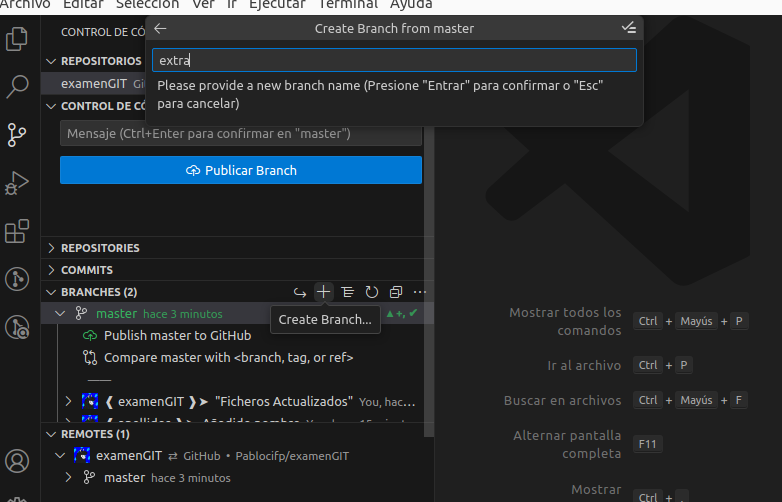
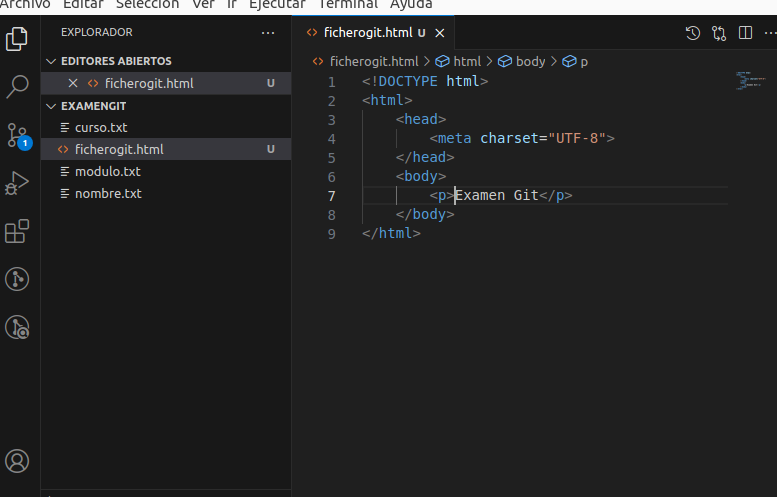
## 5-
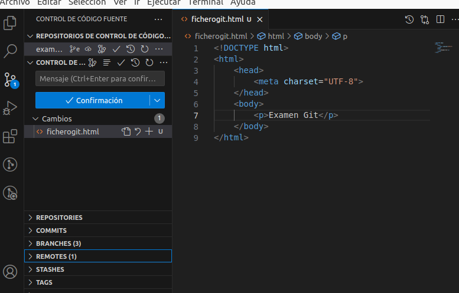
## 6-
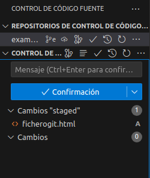
## 7,8-9-10-
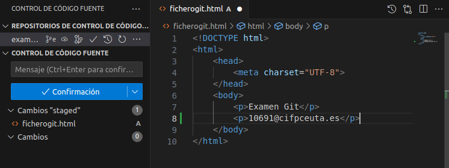
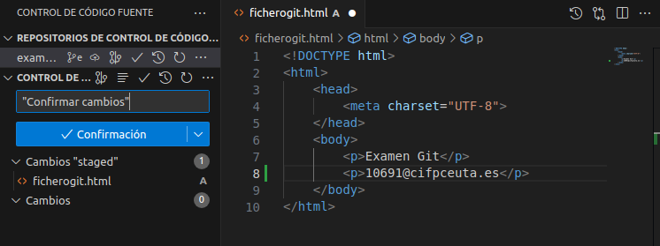
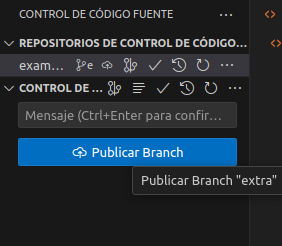
## 11-
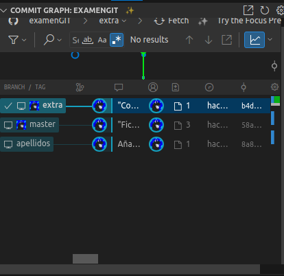
## 12-
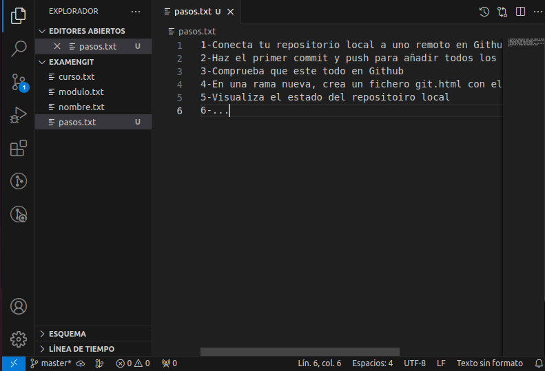
## 13-
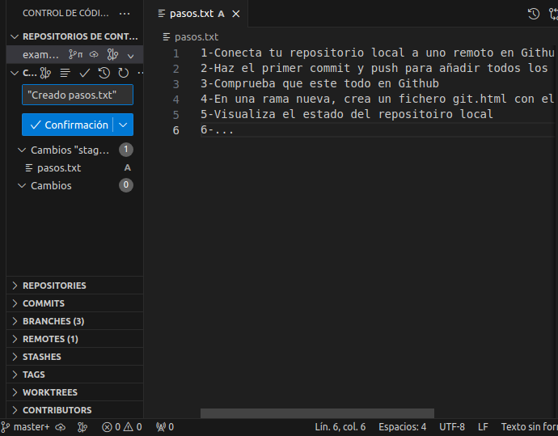
## 14-
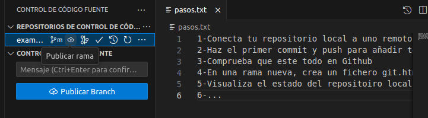
## 15-
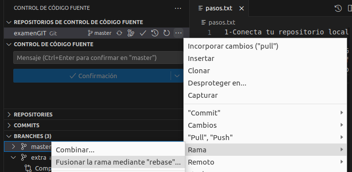
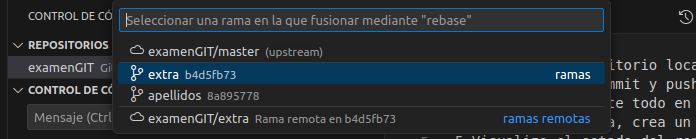
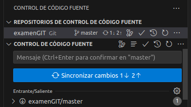
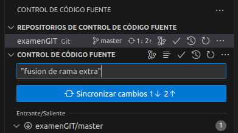
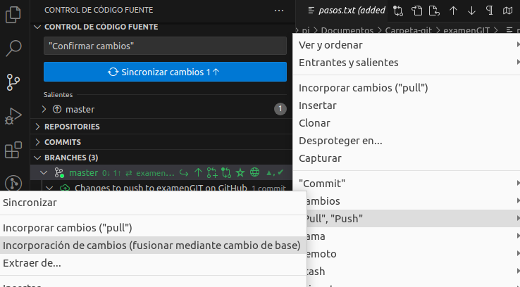
## 16-
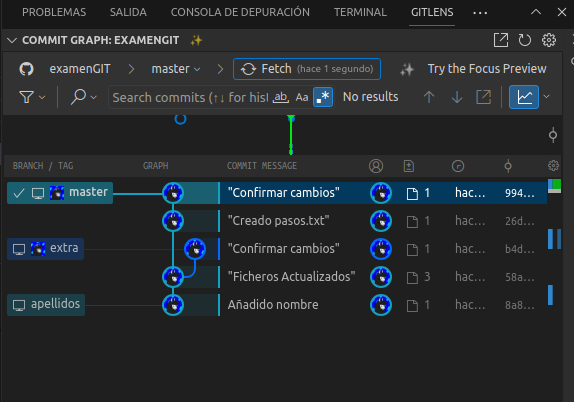