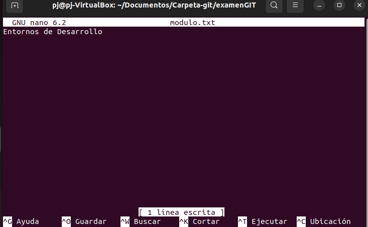
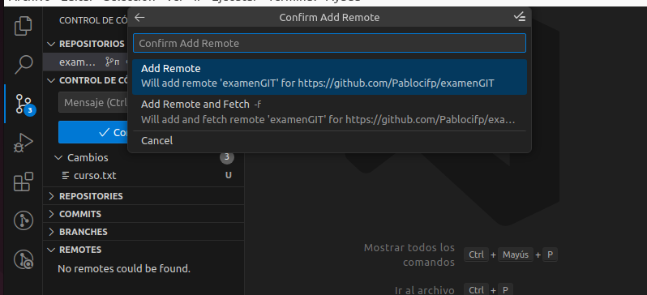
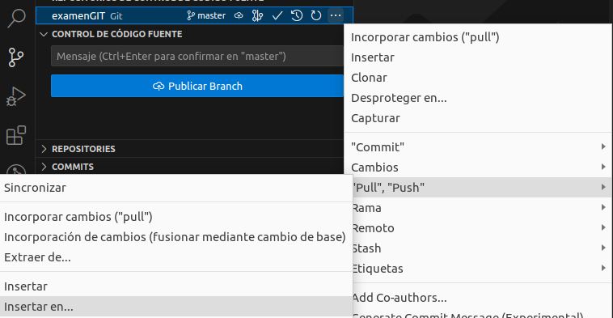

Enlace al repositorio: (https://github.com/Pablocifp/examenGIT)  
### Ejercicio 1
## 1-

## 2,3-

## 4-

## 5-

## 6-

## 7-

## 8- 

## 9,10-

### Ejercicio 2
## 1-

## 2-

## 3-

## 4-

## 5-

## 6-

## 7,8-9-10-

## 11-

## 12-

## 13-

## 14-

## 15-

## 16-
